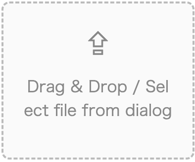

# react-file-dragdrop



This is a sample of a file drag-and-drop function, based on the "[react-dropzone](https://github.com/react-dropzone/react-dropzone)" module. Workaround for 'react-dropzone' bug and deletion of selected files are added.


---

### Purpose:

Create a function in React that allows you to select and cancel local files. Introduce lightweight and low dependency.

### Background:

When selecting, checking, and uploading files locally, we would like to use libraries to streamline event handler settings and differences between browsers.
In addition, many existing well-known drag-and-drop libraries are rich in functionality, and in some cases it takes time to support React18.
Therefore, we have created a sample file drag & drop library that implements only the simplest functions. We use "react-dropzone" as a base.

### Additional Functions:

There is a bug in "react-dropzone" that does not have the ability to delete selected files and some css (flex-direction, etc.). The workaround is included.

## Installation

1. Download files from this github page. (or clone this repository)  
   [https://github.com/diegoammann/react-file-dragdrop](https://github.com/diegoammann/react-file-dragdrop)

2. Install modules.

```
npm install
```

3. Start the app.

```
npm run start
```

4. Open [http://localhost:3000](http://localhost:3000) to view it in the browser.

5. Select a file and drop it on the drop zone. You can also delete the selected file.
   (Dummy file for upload is here: [".txt", ".csv", ".jpg", ".png"](https://github.com/diegoammann/react-file-dragdrop/tree/main/dummy_file))

### Main Modules

- [create-react-app](https://github.com/facebook/create-react-app)
- [react-dropzone](https://github.com/react-dropzone/react-dropzone)
